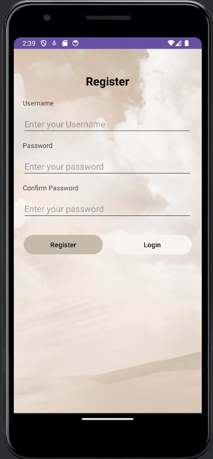
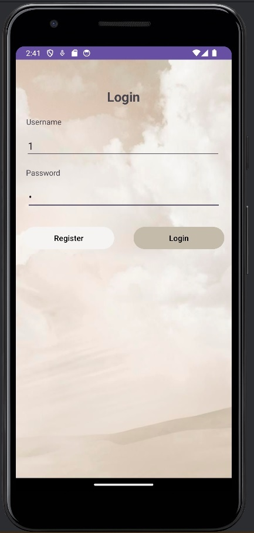
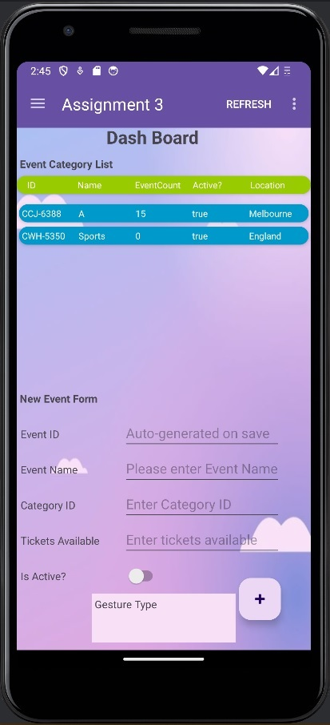
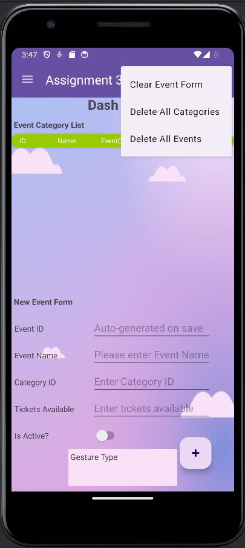
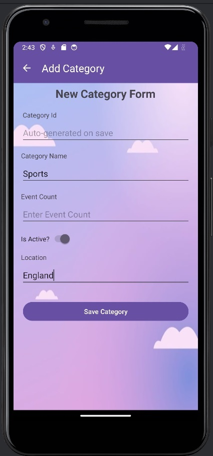
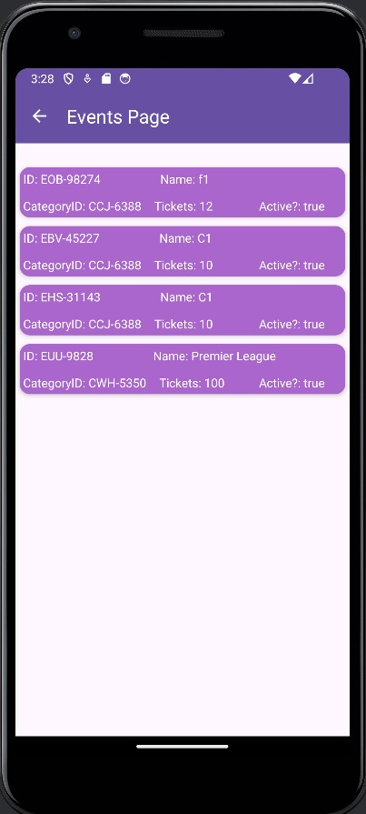
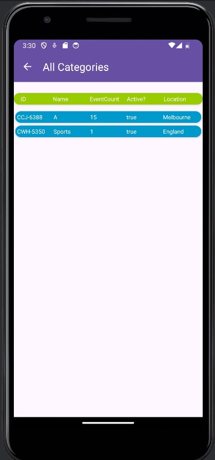
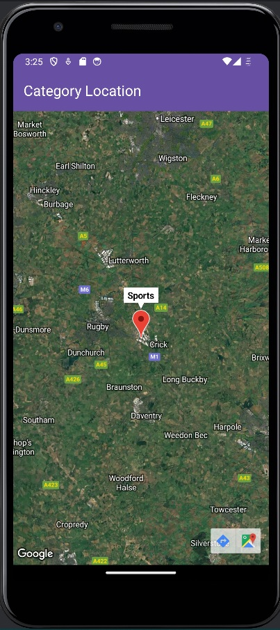
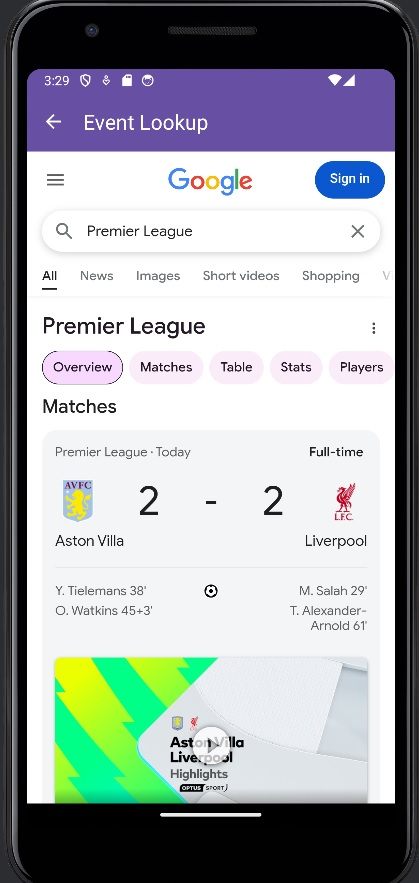

# Android Event Management Application

**Author:** Viet Quoc Tran (Vincent)

---

## Description
This Android application empowers event organizers to efficiently manage their events and related information. It provides a centralized system for tracking crucial details such as ticket counts, event locations, and event status.

---

## Key Features
*   **User Authentication:**
    *   Event organizers can create new accounts.
    *   Existing users can log in securely.
    *   
    *   
    
*   **Event Management:**
    *   **Create:** Organizers can create new events with detailed information.
    *   **Inspect:** View comprehensive details of existing events.
    *   **Delete:** Remove events that are no longer needed.
    *   
    *   
    
*   **Category Management:**
    *   **Create:** Define new categories to organize events.
    *   **Inspect:** View details of existing categories.
    *   **Delete:** Remove categories that are no longer relevant.
    *   
    *   
    
*   **Event and Category Listing:**
    *   **List Events:** View a comprehensive list of all events.
    *   
    
    *   **List Categories:** View a list of all defined categories.
    *   
    
*   **Event and Category Inspection:**
    *   **Event Details:** Access detailed information about events with google search.
    *   **Category Details:** View details about the location for each category
    *   
    *   

---

## Technology Stack
*   **Database:** Room Persistence Library
*   **Architecture:** Model-View-ViewModel (MVVM)
*   **Language:** Java

---

## Getting Started

### Prerequisites

Before you begin, ensure you have the following installed:

*   [Android Studio](https://developer.android.com/studio)
*   Android SDK (configured within Android Studio)
*   Android Emulator (set up within Android Studio)
*   [Git](https://git-scm.com/)

### Installation

1.  **Clone the Repository:**

    You can clone the repository using either HTTPS or SSH:

    *   **HTTPS:**
        ```bash 
        git clone https://github.com/Vincenzoos/android-event-management-app.git
        
    *    **SSH:**
         ```bash
         git clone git@github.com:Vincenzoos/android-event-management-app.git


2.  **Open in Android Studio:**

    *   Launch Android Studio.
    *   Select "Open an Existing Project."
    *   Navigate to the directory where you cloned the repository and select it.

3.  **Set Up an Android Emulator:**

    *   Open the AVD Manager (Tools > AVD Manager).
    *   Create a new virtual device.
    *   Download the necessary system images for your chosen device.

4.  **Build and Run:**

    *   Once the project is open, allow Android Studio to sync the Gradle files.
    *   Select your emulator from the device dropdown.
    *   Click the "Run" button (green play icon) to build and run the application on the emulator.